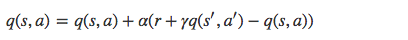
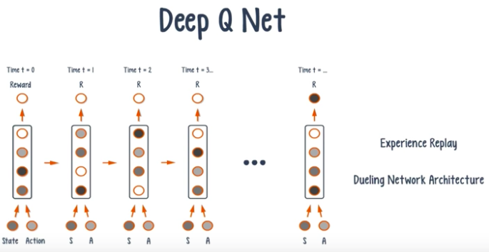
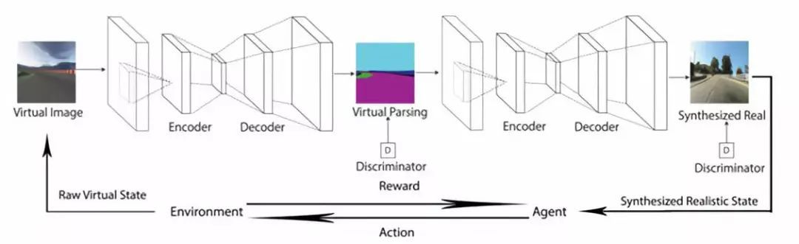

# 编程语言 Python

> Python is an easy to learn, powerful programming language. It has efficient high-level data structures and a simple but effective approach to object-oriented programming. Python’s elegant syntax and dynamic typing, together with its interpreted nature, make it an ideal language for scripting and rapid application development in many areas on most platforms.

> The Python interpreter and the extensive standard library are freely available in source or binary form for all major platforms from the Python Web site, https://www.python.org/, and may be freely distributed. The same site also contains distributions of and pointers to many free third party Python modules, programs and tools, and additional documentation.

> The Python interpreter is easily extended with new functions and data types implemented in C or C++ (or other languages callable from C). Python is also suitable as an extension language for customizable applications.

> This tutorial introduces the reader informally to the basic concepts and features of the Python language and system. It helps to have a Python interpreter handy for hands-on experience, but all examples are self-contained, so the tutorial can be read off-line as well.

> For a description of standard objects and modules, see [The Python Standard Library](https://docs.python.org/3/library/index.html#library-index). [The Python Language Reference](https://docs.python.org/3/reference/index.html#reference-index) gives a more formal definition of the language. To write extensions in C or C++, read [Extending and Embedding the Python Interpreter](https://docs.python.org/3/extending/index.html#extending-index) and [Python/C API Reference Manual](https://docs.python.org/3/c-api/index.html#c-api-index). There are also several books covering Python in depth.

> This tutorial does not attempt to be comprehensive and cover every single feature, or even every commonly used feature. Instead, it introduces many of Python’s most noteworthy features, and will give you a good idea of the language’s flavor and style. After reading it, you will be able to read and write Python modules and programs, and you will be ready to learn more about the various Python library modules described in [The Python Standard Library](https://docs.python.org/3/library/index.html#library-index).

## Python 简介

* Python 是一个高层次的结合了解释性、编译性、互动性和面向对象的脚本语言。  

* Python 的设计具有很强的可读性，相比其他语言经常使用英文关键字，其他语言的一些标点符号，它具有比其他语言更有特色语法结构。
* Python 是一种解释型语言：这意味着开发过程中没有了编译这个环节。类似于PHP和Perl语言。

* Python 是交互式语言： 这意味着，您可以在一个 Python 提示符 **>>>** 后直接执行代码。

* Python 是面向对象语言： 这意味着Python支持面向对象的风格或代码封装在对象的编程技术。

## Python 特点

* 易于学习：Python有相对较少的关键字，结构简单，和一个明确定义的语法，学习起来更加简单。

* 易于阅读：Python代码定义的更清晰。

* 易于维护：Python的成功在于它的源代码是相当容易维护的。

* 一个广泛的标准库：Python的最大的优势之一是丰富的库，跨平台的，在UNIX，Windows和Macintosh兼容很好。

* 互动模式：互动模式的支持，您可以从终端输入执行代码并获得结果的语言，互动的测试和调试代码片断。

* 可移植：基于其开放源代码的特性，Python已经被移植（也就是使其工作）到许多平台。

* 可扩展：如果你需要一段运行很快的关键代码，或者是想要编写一些不愿开放的算法，你可以使用C或C++完成那部分程序，然后从你的Python程序中调用。

* 数据库：Python提供所有主要的商业数据库的接口。

* GUI编程：Python支持GUI可以创建和移植到许多系统调用。

* 可嵌入：你可以将嵌入到程序，让你的程序的用户获得脚本化的能力。

# 强化学习简介

## 定义

>强化学习是机器学习的一个重要分支，是多学科多领域交叉的一个产物，它的本质是解决 **decision making** **问题**，即自动进行决策，并且可以做连续决策。

> 它主要包含四个元素，**agent**，环境状态，行动，奖励, 强化学习的目标就是获得最多的累计奖励。

> 让我们以小孩学习走路来做个形象的例子：

> 小孩想要走路，但在这之前，他需要先站起来，站起来之后还要保持平衡，接下来还要先迈出一条腿，是左腿还是右腿，迈出一步后还要迈出下一步。

> 小孩就是 agent
>
> 

* 强化学习是用来做决定的工具
* 要控制的对象是agent
* 强化学习的目标是获得更多奖励

## 强化学习和监督式/非监督式学习的区别

### 监督式学习

>监督式学习就好比你在学习的时候，**有一个导师在旁边指点**，他知道怎么是对的怎么是错的，但在很多实际问题中，例如 chess，go，这种有成千上万种组合方式的情况，不可能有一个导师知道所有可能的结果。

> 而这时，强化学习会在没有任何标签的情况下，通过先尝试做出一些行为得到一个结果，通过这个结果是对还是错的反馈，调整之前的行为，就这样不断的调整，算法能够学习到在什么样的情况下选择什么样的行为可以得到最好的结果。

> **就好比你有一只还没有训练好的小狗**，每当它把屋子弄乱后，就减少美味食物的数量（惩罚），每次表现不错时，就加倍美味食物的数量（奖励），那么小狗最终会学到一个知识，就是把客厅弄乱是不好的行为。

> 两种学习方式都会学习出输入到输出的一个映射，监督式学习出的是之间的关系，可以告诉算法什么样的输入对应着什么样的输出，强化学习出的**是给机器的反馈 reward function**，即用来判断这个行为是好是坏。

> 另外强化学习的结果反馈有延时，有时候可能需要走了很多步以后才知道以前的某一步的选择是好还是坏，而监督学习做了比较坏的选择会立刻反馈给算法。

> 而且强化学习面对的输入总是在变化，每当算法做出一个行为，它影响下一次决策的输入，而监督学习的输入是独立同分布的。

* 监督式学习需要标签，强化学习不需要标签。
* 强化学习比监督式学习的学习速度慢
* 强化学习的每次输入之间是有联系的

### 非监督式学习

> 非监督式不是学习输入到输出的映射，而是模式。例如在向用户推荐新闻文章的任务中，非监督式会找到用户先前已经阅读过类似的文章并向他们推荐其一，而强化学习将通过向用户先推荐少量的新闻，并不断获得来自用户的反馈，最后构建用户可能会喜欢的文章的“知识图”。  
>
> 

* 强化学习需要利用反馈

# 主要算法和分类

## 分类

>从强化学习的几个元素的角度划分的话，方法主要有下面几类：
>
>Policy based, 关注点是找到最优策略。
>
>Value based, 关注点是找到最优奖励总和。
>
>Action based, 关注点是每一步的最优行动。

> 我们可以用一个最熟知的旅行商例子来看，

> 我们要从 A 走到 F，每两点之间表示这条路的成本，我们要选择路径让成本越低越好：

> 

> 那么几大元素分别是：
>
> states ，就是节点 {A, B, C, D, E, F}
>
> action ，就是从一点走到下一点 {A -> B, C -> D, etc}
>
> reward function ，就是边上的 cost
>
> policy，就是完成任务的整条路径 {A -> C -> F}有一种走法是这样的，在 A  (B, C, D, E) D  D (B, C, F) F  F  ，是一种**Policy based**的方法，当然了这个路径并不是最优的走法

## 算法

> 
>
> **Model-free**：不尝试去理解环境, 环境给什么就是什么，一步一步等待真实世界的反馈, 再根据反馈采取下一步行动。
>
> **Model-based**：先理解真实世界是怎样的, 并建立一个模型来模拟现实世界的反馈，通过想象来预判断接下来将要发生的所有情况，然后选择这些想象情况中最好的那种，并依据这种情况来采取下一步的策略。它比 Model-free 多出了一个虚拟环境，还有想象力。
>
> **Policy based**：通过感官分析所处的环境, 直接输出下一步要采取的各种动作的概率, 然后根据概率采取行动。
>
> **Value based**：输出的是所有动作的价值, 根据最高价值来选动作，这类方法不能选取连续的动作。
>
> **Monte-carlo update**：游戏开始后, 要等待游戏结束, 然后再总结这一回合中的所有转折点, 再更新行为准则。
>
> **Temporal-difference update**：在游戏进行中每一步都在更新, 不用等待游戏的结束, 这样就能边玩边学习了。
>
> **On-policy**：必须本人在场, 并且一定是本人边玩边学习。
>
> **Off-policy**：可以选择自己玩, 也可以选择看着别人玩, 通过看别人玩来学习别人的行为准则。

> **Sarsa**
>
> 
>
> Q 为动作效用函数（action-utility function），用于评价在特定状态下采取某个动作的优劣，可以将之理解为智能体（Agent）的大脑。
>
> SARSA 利用马尔科夫性质，只利用了下一步信息, 让系统按照策略指引进行探索，在探索每一步都进行状态价值的更新，更新公式如下所示：
>
> 
>
> s 为当前状态，a 是当前采取的动作，s’ 为下一步状态，a’ 是下一个状态采取的动作，r 是系统获得的奖励， α 是学习率， γ 是衰减因子。  

> **Deep Q Network**
>
> DQN 算法的主要做法是 Experience Replay，将系统探索环境得到的数据储存起来，然后随机采样样本更新深度神经网络的参数。它也是在每个 action 和 environment state 下达到最大回报，不同的是加了一些改进，加入了经验回放和决斗网络架构。
>
> 

相比传统算法，强化学习结合深度神经网络更有发展空间。而且击败人类的围棋人工智能Alpha Go使用的就是Deep Q Network。我想在研学中学习，研究并使用深度神经网络+强化学习。最好能用这个算法解决一些现实中的问题。

# 应用实例

## Alpha Go

> 摘录Alpha Go论文中有关强化学习的部分

> 摘要：人们长久以来认为：围棋对于人工智能来说是最具有挑战性的经典博弈游戏，因为它的巨大的搜索空间，评估棋局和评估落子地点的难度。我们给电脑围棋程序引入一种新的方法，这个方法使用估值网络来评估棋局，以及使用策略网络来选择如何落子。这些深度神经网络被一种新的组合来训练：使用了人类专业比赛数据的监督学习，以及自我对弈的强化学习。没有使用任何预测搜索的方法，神经网络下围棋达到了最先进的蒙特卡洛树搜索程序的水准，这程序模拟了数以千计的自我对弈的随机博弈。我们同时也引入了一种新的搜索算法，这算法把蒙特卡洛模拟和估值、策略网络结合在一起。运用了这个搜索算法，我们的程序AlphaGo在和其它围棋程序的对弈中达到了99.8%的胜率，并且以5：0的比分击败了欧洲冠军，这是史上第一次计算机程序在全尺寸围棋中击败一个人类职业棋手。在此之前，人们认为需要至少十年才会达成这个壮举。

> **策略网络的强化学习**
>
> 训练管道第二阶段的目标是通过策略梯度强化学习（RL）来提高策略网络。强化学习策略网络pρ pρ 在结构上和 SL策略网络是一样的，权重ρ ρ 初始值也是一样的，ρ=δ ρ=δ 。我们在当前的策略网络和随机选择某先前一次迭代的策略网络之间博弈。从一个对手的候选池中随机选择，可以稳定训练过程，防止过度拟合于当前的策略。我们使用一个奖励函数 r(s)，对于所有非终端的步骤 t < T，它的值等于零。从当前棋手在步骤 t 的角度来讲，结果 zt=±r(sT) zt=±r(sT) 是在博弈结束时候的终端奖励，如果赢棋，结果等于 +1，如果输棋，结果等于 -1。然后权重在每一个步骤 t 更新：朝向最大化预期结果的方向随机梯度递增 
>
> 
>
> 我们在博弈过程中评估 RL策略网络的性能表现，从输出的下棋动作的概率分布，对每一下棋动作at∼pp(⋅∣st) at∼pp(⋅∣st) 进行取样。我们自己面对面博弈，RL策略网络对 SL策略网络的胜率高于80%。我们也测试了和最强的开源围棋软件 Pachi 对弈，它是一个随机的蒙特卡洛搜索程序，在KGS中达到业余2段。在没有使用任何搜索的情况下，RL策略网络对 Pachi的胜率达到了85%。与之相比，之前的最先进的仅仅基于监督学习的卷积网络，对 Pachi的胜率仅只有11%，对稍弱的程序 Fuego的胜率是12%。 

> **估值网络的强化学习**
>
> 训练管道的最后一个阶段关注于棋局评估，评估一个估值函数 vp(s) vp(s) ，它预测从棋局状态 s 开始，博弈双方都按照策略网络 p 下棋的结局， 
>
> 
>
> 理想情况下，我们期望知道在完美下法v∗(s)v∗(s)情况下的最优值；然而在现实中，我们使用 RL策略网络，来评估估值函数vPp vPp ，作为我们的最佳策略。我们使用权重是θ θ 的估值网络 vθ(s)vθ(s)来逼近估值函数，vθ(s)≈vPp≈v∗(s)vθ(s)≈vPp≈v∗(s)。这个神经网络和策略网络拥有近似的体系结构，但是输出一个单一的预测，而不是一个概率分布。我们通过回归到状态-结果对（s, z）来训练估值网络的权重，使用了随机梯度递减，最小化预测估值vθ(s)vθ(s)和相应的结局 z 之间的平均方差（MSE）。 
>
> 
>
> 这个天真的从拥有完整对弈的数据来预测博弈结局的方法导致过度拟合。问题在于，连续的棋局之间的联系十分强大，和仅单独下一步棋有差距，但是回归目标和整个博弈又是相通的。当通过这种方式在KGS数据集合上训练是，估值网络记住了博弈的结局而不是推广出新的棋局，在测试数据上面MSE最小达到了0.37，与之相比在训练数据集合上面MSE是0.19。为了解决这个问题，我们想出了新的自我对弈的数据集合，包含了三千万个不同的棋局，每一个都是从不同盘博弈中采样。每一盘博弈都是在 RL策略网络和自己之间对弈，直到博弈本身结束。在这个数据集合上训练导致了MSE为0.226，和训练和测试数据集合的MSE为0.234，这预示着很小的过度拟合。图2，b展示了估值网络对棋局评估的精确度：对比使用了快速走子策略网络pπ pπ 的蒙特卡洛走子的精确度，估值函数一直更加精确。一个单一的评估vθ(s) vθ(s) 的精确度也逼近了使用了 RL策略网络vθ(s)vθ(s)的蒙特卡洛走子的精确度，不过计算量是原来的15000分之一。

agent自我对弈的方案极大地提高了学习速率，达成了对人类棋手零封的突破。但是仍然应当注意到alpha go使用了巨量的计算资源（比人脑的计算速度高出数个数量级），在某些意义上说明了alpha go 算法的有效性尽管被证明，但是其效率仍远远低于可达的最优水平。alpha go在估值时对于整个棋盘平等对待，而真正的人类选手往往关注于当前正在博弈的区域而降低对其余区域的关注度以极大地降低运算量。同时，人类选手善于记忆并将以往经历过的，初始和最终结果已知的“微对弈”（往往时对某个特定的较小区域进行数步的操作）应用于博弈中来取得计算量的降低和更加稳定和可预测的对弈过程。alpha go尽管在判断局势好坏并作出对应决策的方面已接近于人类。

## 自动驾驶

> 强化学习（Reinforcement Learning）是机器学习的一个热门研究方向。强化学习较多的研究情景主要在机器人、游戏与棋牌等方面，自动驾驶的强化学习研究中一大问题是很难在现实场景中进行实车训练。**因为强化学习模型需要成千上万次的试错来迭代训练，而真实车辆在路面上很难承受如此多的试错**。
>
> 所以目前主流的关于自动驾驶的强化学习研究都集中在使用虚拟驾驶模拟器来进行代理（Agent）的仿真训练，但这种仿真场景和真实场景有一定的差别，训练出来的模型不能很好地泛化到真实场景中，也不能满足实际的驾驶要求。
>
> 加州大学伯克利分校的 Xinlei Pan 等人提出了一种虚拟到现实（Virtual to Real）的翻译网络，可以将虚拟驾驶模拟器中生成的虚拟场景翻译成真实场景，来进行强化学习训练，取得了更好的泛化能力，并可以迁移学习应用到真实世界中的实际车辆，满足真实世界的自动驾驶要求。
>
> 下面为《Virtual to Real Reinforcement Learning for Autonomous Driving》一文的翻译，编者对文章有一定的概括与删改。
>
> 强化学习被认为是推动策略学习的一个有前途的方向。然而,在实际环境中进行自动驾驶车辆的强化学习训练涉及到难以负担的试错。更可取的做法是先在虚拟环境中训练，然后再迁移到真实环境中。本文提出了一种新颖的现实翻译网络（Realistic Translation Network），使虚拟环境下训练的模型在真实世界中变得切实可行。提出的网络可以将非真实的虚拟图像输入转换到有相似场景结构的真实图像。以现实的框架为输入，通过强化学习训练的驾驶策略能够很好地适应真实世界的驾驶。实验表明，我们提出的虚拟到现实的强化学习效果很好。据我们所知，这是首次通过强化学习训练的驾驶策略可以适应真实世界驾驶数据的成功案例。
>
> 
>
> 自动驾驶的目标是使车辆感知它的环境和在没有人参与下的行驶。实现这个目标最重要的任务是学习根据观察到的环境自动输出方向盘、油门、刹车等控制信号的驾驶策略。最直接的想法是端到端的有监督学习，训练一个神经网络模型直接映射视觉输入到动作输出，训练数据被标记为图像-动作对。然而，有监督的方法通常需要大量的数据来训练一个可泛化到不同环境的模型。获得如此大量的数据非常耗费时间且需要大量的人工参与。相比之下，强化学习是通过一种反复试错的方式来学习的，不需要人工的明确监督。最近，由于其在动作规划方面的专门技术，强化学习被认为是一种有前途的学习驾驶策略的技术。
>
> 然而，强化学习需要代理（Agent）与环境的相互作用，不符规则的驾驶行为将会发生。在现实世界中训练自动驾驶汽车会对车辆和周围环境造成破坏。因此目前的自动驾驶强化学习研究大多集中于仿真，而不是在现实世界中的训练。一个受过强化学习训练的代理在虚拟世界中可以达到近人的驾驶性能，但它可能不适用于现实世界的驾驶环境，这是因为虚拟仿真环境的视觉外观不同于现实世界的驾驶场景。
>
> 虽然虚拟驾驶场景与真实驾驶场景相比具有不同的视觉外观，但它们具有相似的场景解析结构。例如虚拟和真实的驾驶场景可能都有道路、树木、建筑物等，尽管纹理可能有很大的不同。因此将虚拟图像翻译成现实图像是合理的，我们可以得到一个在场景解析结构与目标形象两方面都与真实世界非常相似的仿真环境。最近,生成对抗性网络（GAN）在图像生成方面引起了很多关注。提出了一种可以用两个域的配对数据将图像从一个域翻译到另一个域的翻译网络的设想。然而，很难找到驾驶方向的虚拟现实世界配对图像。这使得我们很难将这种方法应用到将虚拟驾驶图像翻译成现实图像的案例中。
>
> 本文提出了一个现实翻译网络,帮助在虚拟世界中训练自动驾驶车辆使其完全适应现实世界的驾驶环境。我们提出的框架（如图 1 所示）将模拟器渲染的虚拟图像转换为真实图像，并用合成的真实图像训练强化学习代理。虽然虚拟和现实的图像有不同的视觉外观，但它们有一个共同的场景解析表现方式（道路、车辆等的分割图）。因此我们可以用将场景解析的表达作为过渡方法将虚拟图像转化为现实图像。这种见解类似于自然语言翻译，语义是不同语言之间的过渡。
>
> 具体来说，我们的现实翻译网络包括两个模块：
>
> - 第一个是虚拟解析或虚拟分割模块，产生一个对输入虚拟的图像进行场景解析的表示方式。
> - 第二个是将场景解析表达方式翻译为真实图像的解析到真实网络。通过现实翻译网络，在真实驾驶数据上学习得到的强化学习模型可以很好地适用于现实世界驾驶。
>
> 为了证明我们方法的有效性，我们通过使用现实翻译网络将虚拟图像转化成合成的真实图像并将这些真实图像作为状态输入来训练我们的强化学习模型。我们进一步比较了利用领域随机化（Domain Randomization）的有监督学习和其他强化学习方法。实验结果表明,用翻译的真实图像训练的强化学习模型比只用虚拟输入和使用领域随机化的强化学习模型效果都要更好。

由上文可知 ，强化学习需要大量的试错才能学到知识，所以需要为强化学习创建一个虚拟的环境。在上文的研究中，使用了对抗网络来把虚拟道路转换成现实图像，实现了模拟真实环境的作用。从中，我了解到强化学习算法可以和其他算法结合，并可以应用到自动驾驶中。

# 结束语

强化学习是一 种无导师的在线学习技术。在马尔可夫环境中，最优搜索型强化学习算法已经被证明收敛性。但对非马尔可夫环境可以进一 步分为部分感知强化学习、函数估计、多agent强化学习以及强化学习偏差技术研究。目前对非马尔可夫环境下的强化学习研究正成为研究的热点。再加上现在热门的神经网络，可以把强化学习和神经网络结合达到更高级的能力。在棋类、自动驾驶等方面又很多应用。